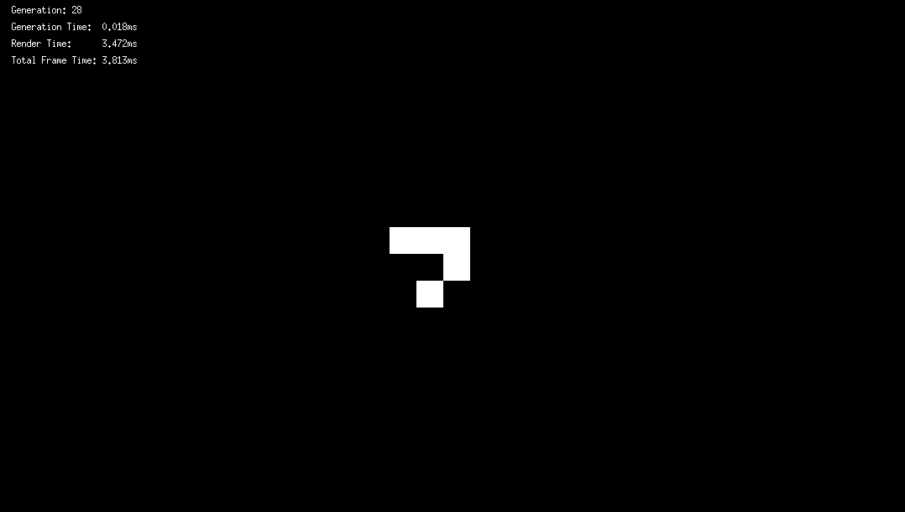

# Game of Life


This is my basic personal implementation of Conway's Game of Life in C using X11.\
I'm using the MinilibX library from 42 school to make interacting with X11 easier. \
Cells are stored in bit arrays, using as less memory as possible.
Thoses bit arrays are separated in dynamically generated chunks, making the board practically infinite.

## Features
- X11 window
- Zoom with mouse scroll
- Camera mouvements with mouse right-click
- Cells editing with mouse left-click
- Step-by-step generation with the '**n**' key
- Maximum speed generation with the **spacebar**
- Load time telemetry
- Option to display chunk borders and change their size (in the defines)

## Compilation
Make sure you have gcc, make, and all the dependencies required by X11 installed:
```
apt-get install gcc make xorg libxext-dev zlib1g-dev libbsd-dev
```
Now simply compile with `make` then launch the program with:
```sh
./game_of_life
```

## Known Bugs
This project was more of a fun side project for me than a serious one, so bugs are present and I can't guarantee they’ll be fixed:
- Incorrect behavior when editing cells fully zoomed out in positive chunks
- Chunks are generated but never deleted, causing the simulation to lag more and more over time
- Chunk sizes smaller than 5 cause the program to crash